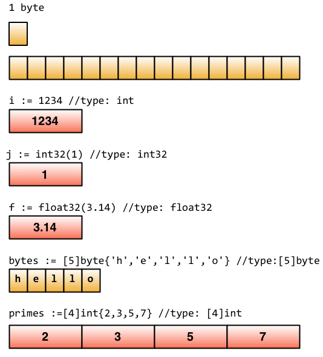

## 一 标识符

#### 1.1 关键字（25个）

```
if      for     func    case        struct      import               
go      type    chan    defer       default     package
map     const   else    break       select      interface
var     goto    range   return      switch      continue     fallthrough                
```

#### 1.2 预定义名字（30+个）

```
内建常量：  
        true        false       iota        nil
内建类型：  
        int         int8        int16       int32       int64
        uint        uint8       uint16      uint32      uint64      uintptr
        float32     float64 
        complex128  complex64
bool：      
        byte        rune        string 	    error
内建函数：   
        make        delete      complex     panic       append      copy    
        close       len         cap	        real        imag        new   	    recover
```

## 二 变量

#### 2.1 变量声明

Go变量声明的三种方式：
```go
	var a int		    // 声明一个变量，默认为0
	var b = 10		    // 声明并初始化，且自动推导类型
	c := 20			    // 初始化，且自动推导
```

注意：
- `:=`定义变量只能在函数内部使用，所以经常用var定义全局变量
- Go对已经声明但未使用的变量会在编译阶段报错：`** not used`
- Go中的标识符以字母或者下划线开头，大小写敏感
- Go推荐使用驼峰命名 

#### 2.2 多变量声明

```go
	var a,b string
    var a1,b1 string = "哼","哈"
    var a2,b2 int = 1,2             //类型可以直接省略
	c,d := 1,2
	var(
		e int
		f bool
	)
```

#### 2.3 零值机制

Go变量初始化会自带默认值，不像其他语言为空，下面列出各种数据类型对应的0值：
```go
int     0
int8    0
int32   0
int64   0
uint    0x0
rune    0           //rune的实际类型是 int32
byte    0x0         // byte的实际类型是 uint8
float32 0           //长度为 4 byte
float64 0           //长度为 8 byte
bool    false
string  ""
```

#### 2.4 变量值互换

```go
m,n = n,m			//变量值互换
temp,_ = m,n		//匿名变量：变量值互换，且丢弃变量n 
```

#### 2.5 _丢弃变量

`_`是个特殊的变量名，任何赋予它的值都会被丢弃。该变量不占用命名空间，也不会分配内存。
```go
_, b := 34, 35      //将值`35`赋予`b`，并同时丢弃`34`：
```

#### 2.6 := 声明的注意事项

下面是正确的代码示例：
```go
in, err := os.Open(file)
out, err := os.Create(file)     // 此处的 err其实是赋值
```

但是如果在第二行赋值的变量名全部和第一行一致，则编译不通过：
```go
in, err := os.Open(file)
in, err := os.Create(file)     // 即 := 必须确保至少有一个变量是用于声明
```

`:=`只有对已经在同级词法域声明过的变量才和赋值操作语句等价，如果变量是在外部词法域声明的，那么`:=`将会在当前词法域重新声明一个新的变量。

## 三 常量

常量：在编译阶段就确定下来的值，程序运行时无法改变。   

定义方式：
```go
const A = 3
const PI float32 = 3.1415
const mask = 1 << 3						//常量与表达式
//const Home = os.GetEnv(“HOME”);		//错误写法：常量赋值是一个编译期行为，右边的值不能出现在运行时才能得到结果的值。  
```

## 四 数据类型

#### 4.1 值类型与引用类型

```
值类型：
    整型（int8,uint等）                 # 基础类型之数字类型
    浮点型（float32，float64）          # 基础类型之数字类型
    复数()                             # 基础类型之数字类型
    布尔型（bool）                      # 基础类型
    字符串（string）                    # 基础类型
    数组                               # 复合类型 
    结构体（struct）                    # 复合类型

引用类型：即保存的是对程序中一个变量的或状态的间接引用，对其修改将影响所有该引用的拷贝
    指针
    切片（slice）
    字典（map）
    函数
    管道（chan）
    接口（interface）
```

注意：没有字符型，使用byte来保存单个字母

类型判断：
```go
fmt.Printf("%T",a);                 //输出a的类型
```
注意：int32和int是两种不同的类型，编译器不会自动转换，需要类型转换。  

#### 4.2 常见格式化输出

```
%%	%字面量
%b	二进制整数值，基数为2，或者是一个科学记数法表示的指数为2的浮点数
%c	字符型
%d	十进制数值，基数为10
%e	科学记数法e表示的浮点或者复数
%E	科学记数法E表示的浮点或者附属
%f	标准计数法表示的浮点或者附属
%o	8进制度
%p	十六进制表示的一个地址值
%s	字符串
%T	输出值的类型
```

#### 4.3 类型别名

```go
type bigint int64	            //支持使用括号，同时起多个别名
var a bigint
```

#### 4.4 多数据分组书写

```go
    const(
        i = 100
        pi = 3.1415
        prefix = "Go_"
    )
    
    var(
        i int
        pi float32
        prefix string
    )

```

#### 4.5 关键字iota

关键字iota声明初始值为0，每行递增1：

```go
const (
	a = iota    	        // 0
    b =	iota 		        // 1        
    c = iota 		        // 2
)

const (
	d = iota    	        //  0
    e 				        // 1        
    f 				        // 2
)

//如果iota在同一行，则值都一样
const (
	g = iota    	        //0
    h,i,j = iota,iota,iota 	       
    k 				        // 2
)

```

#### 4.6 内存结构


