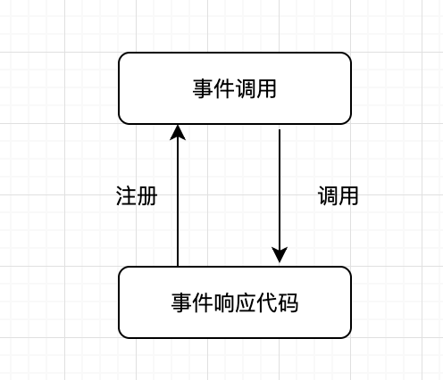

## 一 方法与函数的混合使用

Go语言可以将类型的方法与普通函数作为一个概念，从而简化方法和函数混合作为回调类型时的复杂性。该特性与C#中的delegate类似，调用者无须关心谁来支持调用，系统会自动处理是否调用普通函数还是类型方法。  

以下案例将实现一个普通函数FuncDo，一个类型方法ClassDo，二者签名一致：
```go
package main

import (
	"fmt"
)

type class struct {

}

//方法
func (c *class) ClassDo(v int) {
	fmt.Println("class do: ", v)
}

//函数
func FuncDo(v int) {
	fmt.Println("func do: ", v)
}

func main() {

	//声明一个函数回调
	var delegate func(int)

	c := new(class)

	//将回调设为c的类型方法
	delegate = c.ClassDo
	delegate(100)				// class do:  100

	//将回调设为c的普通函数
	delegate = FuncDo			
	delegate(50)				// func do:  50

}
```

## 二 事件系统原理

事件系统可以将事件派发者与事件处理者解耦，例如网络底层可以生成各种事件，在网络连接上后，网络底层只需要将事件派发出去，而不需要关心到底哪些代码来响应连接上的逻辑。


一个事件系统拥有如下特征：
- 能够实现事件的一方，可以根据事件ID或名字注册对应的事件
- 事件发起者，会根据注册信息通知这些注册者
- 一个事件可以有多个实现方响应

## 三 事件系统开发

#### 3.1 事件注册

事件系统需要为外部提供一个注册入口，这个注册入口传入注册的事件名称和对应事件名称的响应函数，事件注册的过程就是将事件名称和响应函数关联并保存起来。 

```go
//实例化一个通过字符串映射函数切片的map
var EventMap = make(map[string][]func(interface{}))

//注册事件，提供事件名和回调函数
func RegistEvent(eventName string, callback func(interface{})) {

	//通过名字查找事件列表
	eventList := EventMap[eventName]

	//在列表切片中添加函数
	eventList = append(eventList, callback)

	//保存修改的事件列表切片
	EventMap[eventName] = eventList
	
}

```

#### 3.2 事件调用

事件调用方是事发现场，负责将事件和事件发生的参数通过事件系统派发出去，而不关心事件到底由谁处理。

```go
//调用事件
func CallEvent(eventName string, param interface{}) {
	
	//通过名称找到事件列表
	eventList := EventMap[eventName]

	//遍历这个事件的所有回调
	for _, callback := range eventList {
		callback(param)
	}

}

```

#### 3.3 事件调用

```go
//声明角色的结构体
type Actor struct {

}

//为角色添加一个事件处理函数
func (a *Actor) Test(param interface{}) {
	fmt.Println("test event: ", param)
}

//全局事件
func GlobalEvent(param interface{}) {
	fmt.Println("global event: ", param)
}

func main() {

	a := new(Actor)
	RegistEvent("OnSkill", a.Test)		//注册名为OnSkill的事件
	RegistEvent("OnSkill", GlobalEvent)	//再次注册全局事件

	CallEvent("OnSkill", 100)

}

上述事件按照注册的顺序被触发。
```