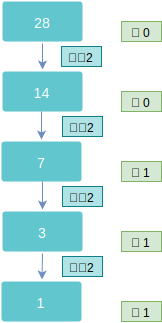

## 一 运算符 

#### 1.1 运算符汇总

```
算术运算符：	+	-	*	/	%	++	--	
关系运算符：	==	!=	<=	>=	<	>	
逻辑运算符：	!	&&	||
位运算：		&（按位与）	|（按位或）	^（按位取反）	<<（左移）	>>（右移）
赋值运算符：	=	+=	-=	*=	/=	%=	<<=	>>=	&=	^=	|=
其他运算符：	&（取地址）	*（取指针值） <-（Go Channel相关运算符）
```

#### 1.2 自增、自减

Go中只有`后--`和`后++`，且自增自减不能用于表达式中，只能独立使用：
```go
a = i++           //错误用法
if i++ > 0 {}     //错误用法
i++               //正确用法
```

#### 1.3 位运算
```
&     按位与，参与运算的两个数二进制位相与：同时为1，结果为1，否则为0
|     按位或，参与运算的两个数二进制位相或：有一个为1，结果为1，否则为0
^     按位异或：二进位不同，结果为1，否则为0
<<    按位左移：二进位左移若干位，高位丢弃，低位补0，左移n位其实就是乘以2的n次方
>>    按位右移：二进位右移若干位，右移n位其实就是除以2的n次方
```

## 二 优先级


## 三 进制转换

#### 1.1 常见进制

- 二进制：只有0和1，Go中不能直接使用二进制表示整数
- 八进制：0-7，以数字0开头
- 十进制：0-9
- 十六进制：0-9以及A-F，以0X开头，A-F以及X不区分大小写

#### 1.2 任意进制转换为十进制

二进制转十进制：  
> 从最低位开始，每个位上数乘以2（位数-1）次方然后求和
> 1011 = 1\*2<sup>0</sup> + 1\*2<sup>1</sup> + 0\*2<sup>2</sup> + 1\*2<sup>3</sup> = 11  

八进制转十进制：  
> 从最低位开始，每个位上数乘以8（位数-1）次方然后求和
> 0123 = 3\*8<sup>0</sup> + 2\*8<sup>1</sup> + 1\*8<sup>2</sup> + 0\*8<sup>3</sup> = 83

其他进制转十进制同理。

#### 1.3 十进制转其他进制

十进制转二进制：  
> 不断除以2，直到0为止,余数倒过来即可，如图计算28转换为二进制11100




十进制转八进制：不断除以8，直到0为止，余数倒过来即可。  

十进制转十六进制：不断除以16，直到0为止，余数倒过来即可。

#### 1.4 其他进制互转

- 二进制转换八进制：将二进制数从低位开始，每三位一组，转换成八进制数即可
- 二进制转十六进制：将二进制数从低位开始，每四位一组，转换成十六进制数即可
- 八进制转换二进制：将八进制数每1位转换成一个3位的二进制数（首位0除外）
- 十六进制转二进制：将十六进制每1位转换成对应的一个4位的二进制数即可  

## 四 计算机运算原理 

对于有符号数而言，二进制的最高为是符号位：0表示正数，1表示负数，比如 1在二进制中：
```
1  二进制位：0000  0001
-1 二进制位：1000  0001
```

正数的原码、反码、补码都一样，负数的反码=原码符号位不变，其他位取反，补码是反码+1
```
         1              -1
原码  0000  0001        1000  0001
反码  0000  0001        1111  1110
补码  0000  0001        1111  1111
```

常见理解：
- 0的反码补码都是0
- 计算机中是以补码形式运算的