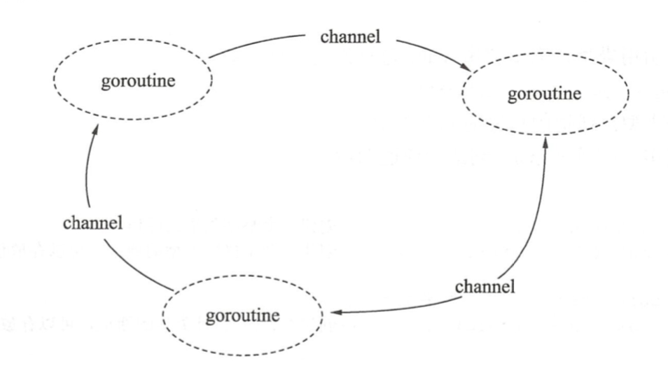
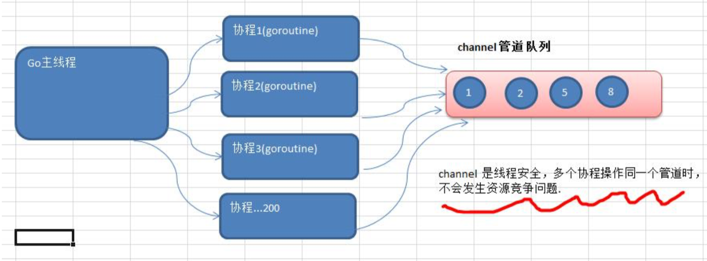

## 一 channel

#### 1.0  channel的引出

单纯的将函数并发执行是没有意义的，函数与函数之间必须能够交换数据才能体现并发执行函数的意义。虽然可以使用共享内存进行数据交换，但是共享内存在不同的goroutine中容易发生竞态问题，为了保证数据的正确性，必须使用互斥量对内存进行加锁，这种做法又肯定造成了性能问题。  

Go提倡使用通信的方式代替共享内存，即使用通道channel。  



多个 goroutine 为了争抢数据，势必造成执行的低效率，使用队列的方式是最高效的， channel 就是一种队列一样的结构 。  

channel特性：
- channel的本质是一个数据结构-队列，先进先出
- channel是线程安全的，多goroutine访问时，不需要加锁，因为在任何时候，同时只能有一个goroutine访问通道。
- channel拥有类型，一个string的channle只能存放string类型数据

如图所示：


#### 1.1 channel的基本使用

channel定义：
```go
	//声明channel，此时没有初始化
	var ch chan int
	fmt.Printf("初始化前，ch=%v\n", ch)			// c1=<nil>

	// 初始化channel,并给与长度,可以省略声明，直接书写：ci := make(chan int, 10)
	ch = make(chan int)
	fmt.Printf("初始化后，ch=%v\n", ch)			// c1=0xc000070060

	// 开启协程向通道中填充数据
	go func() {
		ch <- 100										// 向c中存储一个数据100
		fmt.Printf("入队后数据：%v\n",ch)			// 0xc000070060
		ch <- 200
		fmt.Printf("入队后数据：%v\n",ch)			// 0xc000074000
		ch <- 300
		fmt.Printf("入队后数据：%v\n",ch)			// 此处没有输出
	}()

	// main协程中 取出数据
	data1 := <-ch
	data2 := <-ch
	fmt.Printf("取出的数据data1：%v\n", data1)	// 100
	fmt.Printf("取出的数据data2：%v\n", data2)	// 200
```

channel内可以存储多种数据类型：
```go
//初始化channel
ci := make(chan int)
cs := make(chan string)
cf := make(chan interface{})				// 空接口通道，可以传送任意值
```

#### 1.2 通道数据的接收

通道的收发操作在不同的两个`goroutine`间进行：由于通道的数据在没有接收方处理时，数据发送方会持续阻塞 ，因此通道的接收必定 在另 外一个 goroutine 中进行 。  

接收数据的阻塞与非阻塞：
```go
// 非阻塞接收数据：使用非阻塞方式从通道接收数据时，语句不会发生阻塞
data, ok := <-ch

// 阻塞接收数据：执行该语句时将会阻塞，直到接收到数据并赋值给 data变量
data := <-ch

// 阻塞接收数据，但是忽略接收的数据
<- ch					//直接出队一个数据，且不使用
```

注意：
- 非阻塞的通道接收方法可能造成高的 CPU 占用，因此使用非常少。如果需要实现接收超时检测， 可以配合 select和计时器 channel进行。
- 阻塞式接收但是忽略数据，实际上只是通过通道在 goroutine 间阻塞收发实现并发同步，案例如下：

```go
	ch := make(chan int)		// 没有声明长度却可以装入数据，下面章节介绍

	go func() {
		fmt.Println("start goroutine..")
		ch <- 0
		fmt.Println("exit goroutine..")
	}()

	fmt.Println("wait goroutine..")

	<-ch

	fmt.Println("all done..")
```

#### 1.3 通道数据的遍历接收

channel只支持 for--range 的方式进行遍历：
```go
	ch := make(chan int)

	go func() {
		for i := 0; i <=3; i++ {
			ch <- i
			time.Sleep(time.Second)
		}
	}()

	for data := range ch {
		fmt.Println("data==", data)
		if data == 3 {
			break
		}
	}
```

利用上述特性实现一个简单的生产消费模型：
```go
package main

import (
	"fmt"
)

func printer(c chan int) {
	for {					// 无限循环等待数据
		data := <-c
		if data == 0 {		// 一旦拿到数据0，退出
			break
		}
		fmt.Println("接收到的数据是：", data)
	}
	c <- 0		// 我搞定了：一旦跳出循环，通知main循环结束
}

func main() {

	ch := make(chan int)

	go printer(ch)

	for i := 1; i <= 10; i++ {
		ch <- i
	}

	ch <- 0				// 没数据啦：循环结束后，加入一个数据0
	<-ch				// 搞定喊我：等待printer结束
}
```

#### 1.4 通道的有缓存和无缓冲

之前的案例中声明的通道都是无缓冲的，无缓冲的通道指在接收前没有能力保存任何值的通道，这种类型的通道要求发送goroutine和接收goroutine同时准备好，否则会导致先执行发送或接收操作的goroutine阻塞。这种对通道的操作行为是同步的，其中任意一个操作都无法离开另一个操作单独存在。  

channel队列让协程同步：
```go
package main

import (
	"fmt"
	"time"
)

func test(c chan bool) {
	time.Sleep(5 * time.Second)
	fmt.Println("异步执行test...")
	c <- true
}


func main() {

	var exitChan chan bool
	exitChan = make(chan bool)
	go test(exitChan)
	fmt.Println("主线程执行...")
	<-exitChan		//输出主线程执行后，去管道取数据，但是管道没有数据，会一直等待数据，即等待go协程函数填入队列

}	
```


在无缓冲通道的基础上，为通道增加一个有限大小的存储空间形成带缓冲通道：
```go
	ch := make(chan int, 3)					// 3就是缓冲长度
	fmt.Println("缓冲长度：", len(ch))		// 0
	ch <- 1
	ch <- 2
	fmt.Println("缓冲长度：", len(ch))		// 2
```
在上述案例中，因为使用了缓冲通道。即便没有 goroutine 接收，发送者也不会发生阻塞。

注意区分通道的容量与长度：
- 容量：cap(ch)，即通道声明时设置可溶两大小。
- 长度：len(ch)，即通道中实际存储的数据多少。

带缓冲通道发生阻塞条件：
- 带缓冲通道被填满时，尝试再次发送数据时发生阻塞。
- 带缓冲通道为空时，尝试接 收数据时发生阻塞。

贴士：为什么 Go语言对通道要限制长度而不提供无限长度的通道?  
通道( channel )是在两个 goroutine 间通信的桥梁。使用 goroutine 的代码必然有一方提供数据，一方消费数据 。 当提供数据一方的数据供给速度大于消费方的数据处理速度时，而通道也不限制长度，那么内存将不断膨胀直到应用崩溃。

#### 1.5 单向通道 只读与只写

默认情况下管道是双向的，但是也可以声明为为只读，或者只写性质。  

单向channel只能用来发数据或者接受数据，事实上由于不能让goroutine锁死，channel必须是双向的，这里的单向channel只是对其使用的限制。

```go
	var chan1 chan<- int		//只写
	var chan2 <-chan int 		//只读
```

单向channel的转换与使用：
```Go

ch4 := make(chan int)
ch5 := <-chan int(ch4)
ch6 := chan<- int(ch4)
func Parse(ch <-chan int) {
    for value := range ch {
        fmt.Println(“Parsing value,” value)
    }
}
```

单向通道的应用场景：不能写入数据的通道是毫无意义的，但是单向通道能保证代码接口的严谨性。
```go
// time包中的计时器会返回一个 timer实例
timer := time .NewTimer(time .Second)

// timer的Timer定义如下：
type Timer struct {
	c <一chan Time
	r runt工meT工mer
}
```
此处不进行通道方向约束， 一旦外部向通道发送数据， 将会造成其他使用到计时器的地方逻辑产生混乱。


#### 1.6 通道关闭

通道是一个引用对象，支持GC回收，但是通道也可以主动被关闭

```go
	ch := make(chan int)
	close(ch)		// 关闭通道
	ch <- 1			// 报错：send on closed channel
```

从己关闭的通道接收数据时将不会发生阻塞：从 已经关闭的通道接收数据或者正在接收数据时，将会接收到通道类型的零值，然后 停止阻塞并返回。
```go
	ch := make(chan int, 2)
	ch <- 0
	ch <- 1
	close(ch)

	for i := 0; i < cap(ch) + 1; i++  {
		v, ok := <-ch
		fmt.Println(v,ok)	// 分别打印 0 true  1 true  0 false
	}
```


通道在遍历时候关闭，需要注意两个细节：
- 在遍历时，如果 channel 没有关闭，则会出现 deadlock 的错误
- 在遍历时，如果 channel 已经关闭，则会正常遍历数据，遍历完后，就会退出遍历。

```go
	ch := make(chan int, 10)
	for i := 0; i < 10; i++ {
		ch <- i
	}

	//关闭:关闭后不能再向 channel 写数据，但可以从该 channel 读取数据。
	close(ch)			

	for v := range ch {
		fmt.Println("v=", v)
	}
```

如何判断管道被关闭：
```go
data, ok := <-ch
if ok == false {

}

```
给被关闭的通道发送数据会造成panic，不过已经关闭的通道在接收数据时不会发生阻塞。

#### 1.7 全局唯一操作

某些函数只允许调用一次，但是有goroutine的情况下无法控制，Go引入了Once：

```Go
var a string
var onec sync.Once
func setup() {
    a = “hi”
}
func doprint() {
    once.Do(setup)
    print(a)
}
```
如果主协程退出，那么其他子协程也会退出


