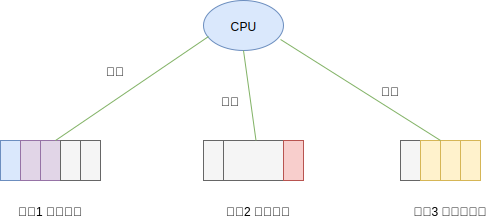
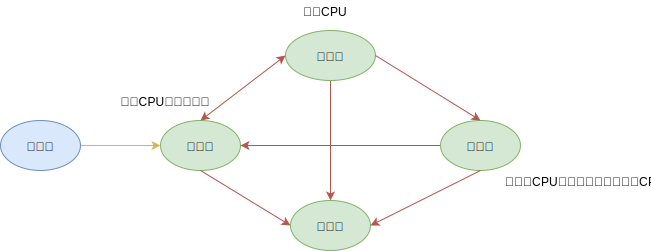

## 一 并发编程历史  

在早期的操作系统中，各个任务的执行完全是串行的，只有在一个任务运行完成之后，另一个任务才会被读取。  

现代操作系统引入了`多道程序`的并发概念：当一个程序暂时不需要使用CPU的时候，系统会把该程序挂起或中断，这时其他程序可以使用CPU，多个任务在操作系统的控制中，可以实现宏观上的并发。    

但是这样也引起了多个任务对系统资源的无限制抢夺，造成死锁，在开发上极度不便。 

## 二 串行与并发

#### 2.1 并发理论基础

串行与并发区别：
- 串行程序：按照顺序执行的程序指令
- 并发程序：可以被并发执行的多个程序（即：宏观上的同时执行）

并行程序：与串行、并发并不是一个维度的概念，并行是指某个任务被多个处理器同时处理，最终产生一个处理结果，比如分布式系统的概念。

并发与并行区别：二者概念的区别是是否同时执行，比如吃饭时，电话来了，需要停止吃饭去接电话，接完电话继续吃饭，这是并发执行，但是吃饭时电话来了，边吃边接是并行。  

#### 2.2 并发解决方案

- 多进程:由系统内核管理并发，操作简单、进程互不影响。但是开销最大，占用资源较多，能开启的进程数极少，
- 多线程:多线程在大部分系统上仍然属于系统层面的并发，开销较大，且会存在死锁管理问题。
- 非阻塞I/O:基于回调的异步非阻塞I/O，尽可能少的运用线程，参见Node.js
- 协程:本质上仍然是用户态线程，但不需要系统进行抢占式调度，且真正的实现寄存于线程中，开销极小。

#### 2.3 并发程序数据交互方式：同步

并发程序在访问同一资源，或者彼此间需要传递数据时，需要协调程序的执行，否则容易出现数据使用的异常现象，这个处理过程，称为同步。  

同步的作用是避免在并发访问共享资源时可能发生的冲突。  

同步的理念：
- 程序如果想使用一个共享数据，就必须先获取对它的使用权，当程序不再使用该资源时，则应放弃对该资源的访问权(即：释放资源)。
- 资源的使用权被拿走后，其他访问该资源的程序不应该被中断，而是应该等到拥有使用权的程序释放资源之后再进行访问。  
即：在同一时刻，某个资源应该只被一个程序占用。  

#### 2.4 并发程序数据交互方式：数据传递

除了使用同步方式来实现并发程序数据的交互之外，还可以使用数据传递方式（也称为通信）。  

该方式可以使数据不加延迟的发送给数据接收方。即使数据接收方还没有为接收数据做好准备，也不会造成数据发送方的等待。数据会被临时存储在一个称谓通信缓存的数据结构中。通信缓存是一种特殊的数据结构，可以同时被多个程序使用，数据接收方可以在准备就绪之后按照数据存入通信缓存的顺序接收它们。  

## 三 进程 线程 协程

#### 3.1 进程

进程：就是二进制可执行文件在计算机内存中的运行实例，可以简单理解为：一个.exe文件是个类，进程就是该类new出来的实例。  

在操作系统运行过程中，可以产生很多进程。在Unix系统中，子进程是通过父进程fork创建的，父进程无法预测子进程什么时候结束。只有进程完成工作终止后，父进程才会调用取得子进程的终止态。  

多进程容易产生的问题：  
- 孤儿进程：父进程先于子进程结束，则子进程成为孤儿进程，且系统最开始的init进程称为其父进程，我们称之为init进程领养孤儿进程。  
- 僵尸进程：进程终止，父进程尚未回收，子进程残留资源（PCB）于内核中，变成僵尸进程。

#### 3.2 线程

线程：可以简单理解为一个微进程，专门负责运行一个函数（逻辑流），分为以下两种：
- 内核线程：可以操作系统调用，由操作系统管理
- 用户线程：开发者书写的程序负责管理，无法操作系统调用

线程是操作系统基于进程开启的轻量级进程，与进程一样拥有独立的PCB，但是没有独立的地址空间（即线程之间共享了地址空间）。

理解：
- 地址空间是按照进程分配的，但是在地址空间里有线程栈
- 线程是调度执行的最小单位（即cpu分配时间轮片的对象）
- 进程是资源分配的最小单位（如虚拟内存资源）

共享地址空间：

线程同步：线程在发出某一个功能调用时，如果没有得到结果，则该调用不返回。此时其他线程不能调用该功能（因为要保证数据一致性）。  

线程同步是为了避免引起数据混乱。实际上，多个控制流共同操作一个共享资源，都需要同步，比如：进程、线程、信号之间都需要同步机制。 

#### 3.3 协程

协程：可以暂时理解为一个轻量级线程（这个理解是错误的，只是暂时学习这个概念），但是在执行时，函数内部可以中断，适当时候返回接着执行。 

**注意**：协程并不是大多数博客所说的轻量级线程，线程受控于操作系统，而协程由各大语言本身的运行时控制。这一点将会在goroutine章节中详细讲解。  

协程的优势在于其轻量级、执行效率高：没有线程开销
- 执行效率高：函数之间的切换不再是线程切换，程序自身控制
- 轻量级：可以轻松创建上百万个协程而不会造成系统资源衰竭

线程需要上下文不停切换，而协程不会主动交出使用权，除非代码中主动要求切换，或者发生I/O，此时会切换到别的协程，这样能更好的解决并发问题。  