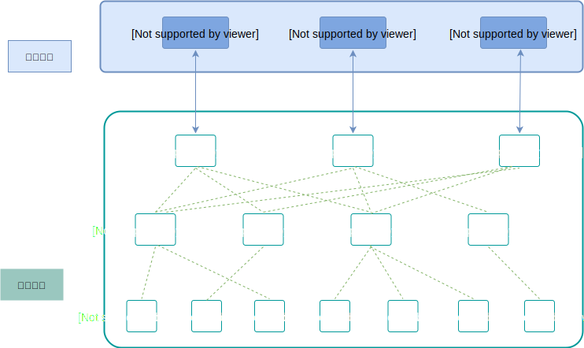
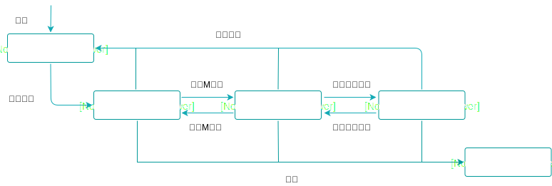
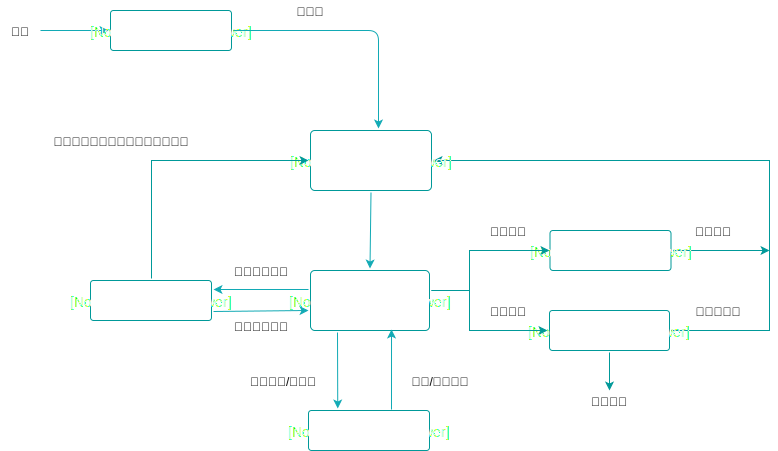

## 一 go通信主张

数据放在共享内存中提供给多个线程访问的方式，虽然思想上简单，但却有两个问题：
- 使并发访问控制变得复杂
- 一些同步方法的使用会让多核CPU的优势难以发挥

Go的著名主张：
> 不要用共享内存的方式来通信，应该以通信作为手段来共享内存

Go推荐使用通道（channel）的方式解决数据传递问题，在多个goroutine之间，channel复杂传递数据，还能保证整个过程的并发安全性。  

当然Go也依然提供了传统的同步方法，如互斥量，条件变量等。  

## 二 Go线程模型

#### 2.0 线程模型三元素

Go的线程实现模型有三个元素，即MPG：
- M：machine，一个M代表一个工作线程
- P：processor，一个P代表执行一个Go代码段需要的上下文环境
- G：goroutine，一个G代表一个Go协程

每个G的执行需要P和M的支持，M与P关联后才会形成一个有效的G运行环境，即 `工作线程+上下文环境`。  

内核调度实体（KSE）负责调度这些工作线程M，每个实体对应一个M，如图所示：   

 

#### 3.1 M

工作线程M用来关联上下文环境P。  

创建新的工作线程M时机：
- 没有足够的工作线程
- 一些特殊情况下，如：执行系统监控，执行垃圾回收等   

M常用源码字段如下：
```go
type m struct {
    g0 *g                   // Go运行时启动之初创建，用于执行运行时任务
    mstartfn func()         // M起始函数，即代码中 go 携带的函数
    curg *g                 // 存储当前正在运行的代码段G的指针
    p puintptr              // 指针：当前关联的上下文P
    nextp puintptr          // 指针：与当前M有潜在关联的P，调度器将某个P赋给某个M的nextp，则及时预关联
    spinning bool           // 当前M是否正在寻找可运行的G
    lockedg *g              // 与当前M锁定的G
}
```

M的生命：
- 创建：
  - M被创建后，就会加入全局M列表（runtime.allm)，并设定M的 mstartfn、p （起始函数、上下文环境）
  - 然后，运行时为M创建一个新工作线程并与之关联
  - 起始函数只作为系统监控和垃圾回收使用（通过起始函数可以获取M所有信息，也可以防止M被当做垃圾回收掉）。   
- 停止：
  - 运行时停止M时，M会被放入空闲M列表（runtime.sched.midle)
  - 运行时从该列表中回收M

Go可以手动设定可以使用的M数量：
```go
runtime/debug.SetMaxThreads
```
一个Go程序默认最多可使用10000个M，该值越早设定越好。

#### 3.2 P

goroutine（即G）如果需要运行，需要获得运行时机。当Go运行时让上下文环境P与工作线程M建立连接后，P中的G就可以运行。     

P的结构包含两个重要成员：
- 可运行G队列：要运行的G列表
- 自由G列表：已完成运行的G列表，可以提高G的复用率

贴士：
> P的数量即是G的队列数量，其最大值用来限制并发运行G的规模，可以在`runtime.GOMAXPROCS`中设置。  

P的重复利用：
- 连接：Go运行时让P与M连接后，P中的G开始运行
- 分离：G进入系统调用后，运行时会将M和对应的P分离
  - 如果P的可运行队列中还有未被运行的G，运行时会找到一个空闲的M或者创建新的M，并与该P关联，以满足剩余的G运行需要，所以一般情况下M的数量都会比P多。  
- 空闲：P与M分离后，会被放入空闲P列表(runtime.sched.pidle)
  - 此时会清空P中的可运行G队列，如果运行时需要一个空闲的P与M关联，则从该列表取出一个  

P的生命，如图：  

  

贴士：
- 非Pdead状态的P都会在运行时要停止调度时被设置为Pgcstop状态，等到要重新调度时，不会被恢复到原有状态，而是统一被转换为Pidle状态，公平接受再次调度。  
- 自由G列表会随着完成运行的G增多而增大，到一定程度后，运行时会将其中部分G转移到调度器自己的自由G列表中。

#### 3.3 G

一个G代表一个Go协程goroutine，即go函数。

在go函数启动一个G时：
- 运行时会先从相应的P的自由G列表获取一个G封装go函数
- 如果P的自由G列表为空，则会从调度器本身的自由G列表中转移过来一些G到P的自由G列表中
- 如果调度器本身的自由G列表也为空，则新建一个G

运行时本身持有一个G的全局列表（runtime.allgs)，用于存放当前运行时系统中所有G的指针，新建的G会被加入该列表。  

执行步骤：
- 初始化：无论是新G还是取出来的G都会被运行时初始化，包括其关联函数、G状态、ID
- 将初始化后的G存储到本地P的runnext字段中
- 如果runnext字段中已经存在G，则存在的G会被踢到该P可运行G队列的末尾，如果队列已满，则G只能追加到调度器本身的可运行G队列中

每个G都会由运行时根据需要设置为不同的状态：
- Gidle：刚被分配，未初始化
- Grunnabel：正在可运行队列中等待运行
- Grunning：正在运行
- Gsyscall：正在执行某个系统调用
- Gwaiting：G被阻塞中
- Gdead：G闲置中
- Gcopystack：G的栈因为扩展或收缩，正在被移动

G还有一些组合状态Gscan，组合态代表G的栈正在被GC扫描，如：
- Gscanrunnable：G等待运行中，它的栈也被正在扫描（因为垃圾回收）
- Gscanrunning：G运行中，它的栈正在被GC扫描


G的状态转换图：  
  

注意：
- 进入死亡状态Gdead的G可以重新被初始化
- 但是P进入死亡状态Pdead后只能被销毁

## 四 MPG容器 

MPG常见容器：  

| 名称 | 源码 | 作用域 | 说明 |
| ------ | ------ | ------ | ------ |
| 全局M列表 | runtime.allm | 运行时 | 存放所有M的单向链表 |
| 全局P列表 | runtime.allp | 运行时| 存放所有P的数组 |
| 全局G列表 | runtime.allgs | 运行时 | 存放所有G的切片 |
| 空闲M列表 | runtime.sched.midle | 调度器 | 存放空闲M的单向链表 |
| 空闲P列表 | runtime.sched.pidle | 调度器 | 存放空闲P的单向链表 |
| 调度器可运行G队列 | runtime.sched.runqhead runtime.sched.runqtail | 调度器 | 存放可运行G的队列 |
| 调度器自由G列表 | runtime.sched.gfreeStack runtime.sched.gfreeNoStack | 调度器 | 存放自由G的两个单向链表 |
| P可运行G队列 | runtime.p.runq | 本地P | 存放当前P中可运行的G的队列 |
| P自由G列表 | runtime.p.gfree | 本地P | 存放当前P的自由G的单向链表 | 

贴士：
- 任何G都会存在于全局G列表中，其余的4个容器则只会存放在当前作用域内的具有每个状态的G。  
- 调度器的可运行G列表和P的可运行G列表拥有几乎平等的运行机会：
  - 刚被初始化的G都会被放入本地P的可运行G队列
  - 从Gsyscall状态转出的G都会被放入调度器的可运行G队列
  - Gdead状态的G，会被放入本地P的自由G列表

两个可运行G队列会互相转移G：
- 调用runtime.GOMAXPROCS函数，会导致运行时系统把将死的P的可运行G队列中的G全部转移到调度器的可运行G队列
- 如果本地P的可运行G队列已满，则一半的G会被转移到调度器可运行G队列中
