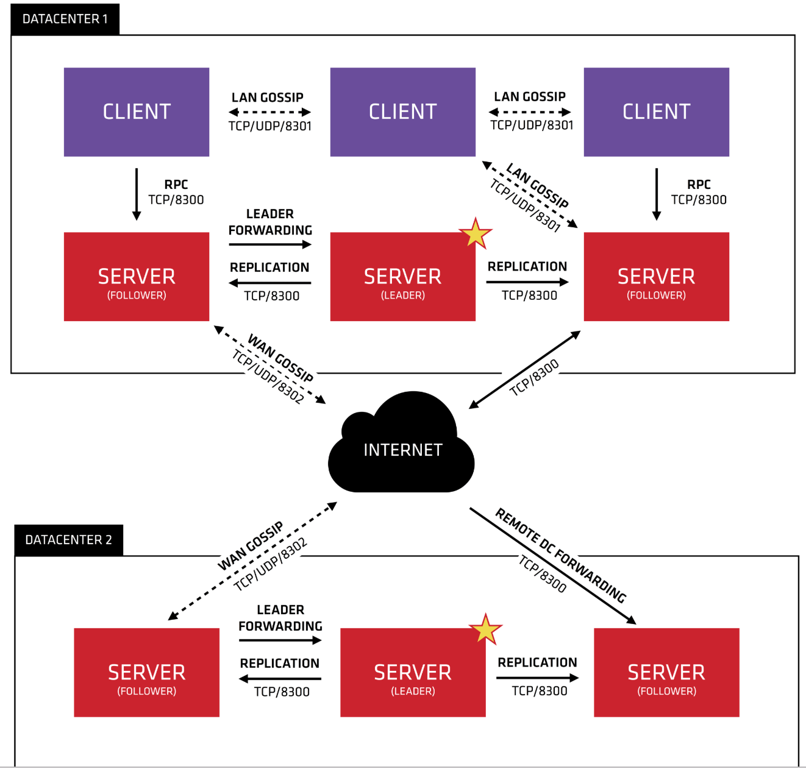

## 一 consul概述

#### 1.1 consul简介

consul由HashiCorp公司开源，可用于实现分布式系统的服务发现与配置，具备特性有：
- 键值存储（key/value storage）：consul有一个用来存储动态配置的系统，并提供了简单的HTTP接口来操作
- 服务发现（service discovery）：consul的客户端可以提供一个服务，另外的客户端可以使用consul发现一个指定服务的提供者，consul通过DNS或者HTTP接口使服务注册和服务发现变的很容易，且可以注册外部服务
- 健康检查（health checking）：consul的健康检查可以快速对集群中的操作发出警报，以防止服务转发到故障服务上
- 多数据中心（multi-datacenter）：无需复杂的配置，即可支持任意数量的数据区域。 

consul是强一致性的数据存储，且内嵌了服务发现系统（etc没有，只是一个键值存储），consul为多种数据中心提供了开箱即用的原生支持，其中的gossip系统不仅可以工作在同一集群内部的各个节点，而且还可以跨数据中心工作。

#### 1.2 consul应用场景

consul的三个主要应用场景：
- 服务发现：consul作为注册中心，服务地址被注册到consul中以后，可以使用consul提供的dns、http接口查询、健康检查health check。
- 服务隔离：consul支持以服务为单位设置访问策略，能同时支持经典的平台和新兴的平台，支持tls证书分发，service-to-service加密。   
- 服务配置：consul提供key-value数据存储功能，并且能将变动迅速地通知出去，通过工具consul-template可以更方便地实时渲染配置文件。 

技术细节: 
```
每个被注册到consul中的node上，都部署一个consul agent，这个agent负责对本地的服务进行监控检查，以及将查询请求转发给consul server。
consul server负责存放、备份数据(使用raft协议保证一致性)，通常要有多台形成集群，选举出一个leader。
查询服务地址的时候，可以直接向consul server发起查询，也可以通过consul agent查询，后者将转发给consul server。
如果是多数据中心，每个数据中心部署一组consul server。跨数据中心查询通过本数据中心的consul server进行。
注意：多数据中心的时候，不同数据中心的consul server之间不会同步key-value数据。
```

  

注意上图中有两种类型的gossip，一类是同一个数据中心内部的client之间进行gossip通信，一类是不同数据中心的server之间进行gossip通信。  

## 二 consul安装

下载地址：https://www.consul.io/downloads.html

mac和linux版只需要将二进制文件移动到 `/usr/local/bin`目录中即可，测试安装命令`consul`。

consul提供了开发模式用于启动单节点服务，用于开发调试：
```
consul agent -dev

# 访问可视化界面
http://127.0.0.1:8500/ui/dc1/nodes
```

## 三 consul架构

consul是典型的 C/S 架构，其集群由 N 个 Server 与 M 个 Client 组成的。他们都是consul的一个节点，所有的服务都可以注册到这些节点上，正是通过这些节点实现服务注册信息的共享。 

consul必须运行agent，agent可以运行为server或client模式：
- client: consul的client模式，是一个无状态客户端，用来将 HTTP 和 DNS 接口请求转发给局域网内的服务端集群，即 所有注册到当前节点的服务会被转发到 Server，本身不持久化这些信息
- server: consul的server模式，是一个高可用集群，功能和client一样，但是会会把所有的信息持久化的本地，可以用来保存配置信息，在局域网内与本地客户端通讯，通过广域网与其他数据中心通讯。

每个数据中心至少必须拥有一台server，建议在一个集群中有3或者5个server，部署单一的server，在出现失败时会不可避免的造成数据丢失。其他的agent运行为client模式，一个client是一个非常轻量级的进程，用于注册服务。  

ServerLeader 表明这个 Server 是它们的老大，它需要负责同步注册的信息给其它的 Server ，同时也要负责各个节点的健康监测。  

consul可以用来实现分布式系统的服务发现与配置：
- client把服务请求传递给server
- server负责提供服务以及和 其他数据中心交互。

既然server端提供了所有服务，那为何还需要多此一举地用client端来接收一次服务请求？  

首先：server端的网络连接资源有限。分布式系统的访问量一般很大，如果没有client，数据中心需要为每个用户提供一个单独的连接资源（线程、端口号等），那么server端压力会极大。利用client，可以整合用户的服务请求，然后通过一个单一的链接一次性发送给server端，以减少server端的负担。  
其次：client端也可以对用户的请求进行一些处理，比如缓存相同请求的响应内容。  
最后：依赖于这种cs架构，consul只要接入一个client就能将自己注册到一个服务网络当中，系统的可扩展性非常更强

## 四 consul集群架设示例

### 4.1 启动2个服务端

以server模式运行agent，启动第一个节点node1：
```
consul agent -server -bootstrap-expect 2 -data-dir ~/tmp/consul/data -node=n1 -bind=192.168.186.128 -ui -config-dir /etc/consul.d -rejoin -join 192.168.186.128 -client 0.0.0.0
```

以server模式运行agent，启动第二个节点node1：
```
consul agent -server -bootstrap-expect 2 -data-dir ~/tmp/consul/data -node=n2 -bind=192.168.186.129 -ui -rejoin -join 192.168.186.128
```

参数解释：
```
server：定义agent运行在server模式
bootstrap-expect：期望提供的server节点数，提供该值后，consul一直等到sever数目达到该值时才会引导整个集群，注意不能和bootstrap共用 
data-dir：存放agent状态的目录
node：节点在集群中的名称，必须是唯一的，默认是该节点的主机名 
bind：该地址用来在集群内部的通讯，集群内的所有节点到地址都必须是可达的，默认是0.0.0.0
ui：启动web界面
config-dir：配置文件目录，里面所有以.json结尾的文件都会被加载 
rejoin:使consul忽略先前的离开，在再次启动后仍旧尝试加入集群中。
client：consul服务侦听地址，这个地址提供HTTP、DNS、RPC等服务，默认是127.0.0.1所以不对外提供服 务，如果你要对外提供服务改成0.0.0.0
join：启动时加入这个哪个集群
```

### 4.2 启动1个客户端

node3：
```
# 以client模式运行cosnul agent，-join 加入到已有的集群中去。
consul agent -data-dir /tmp/consul -node=n3 -bind=192.168.186.130 -config-dir /etc/consul.d -rejoin -join 192.168.186.128
```

### 4.3 简单操作集群

```
# 查看集群成员：
consul members      # 需要在新开的终端窗口操作

# 停止Agent，退出集群
consul leave        # 可以优雅关闭，避免引起潜在的可用性故障影响达成一致性协议

# 查看所有结点
consul catalog nodes
```

使用Ctrl+C也可以关闭Agent，在退出中，Consul会提醒其他集群成员，这个节点离开了。如果强行杀掉进程，则集群的其他成员应该能检测到这个节点失效：
- 当一个成员离开，他的服务和检测也会从目录中移除
- 当一个成员失效了，他的健康状况被简单的标记为危险，但是不会从目录中移除
- Consul会自动尝试对失效的节点进行重连

当然也可以在web界面操作：http://127.0.0.1:8500/

## 五 集群服务的注册

搭建好conusl集群后，用户或者程序就能到consul中去查询或者注册服务。可以通过提供服务定义文件或者调用HTTP API来注册一个服务。  

操作步骤：
```
# 为consul配置一个目录，consul会载入配置目录中的所有配置文件
mkdir /etc/consul.d

# 假设有一个名为 mysrv 的服务，运行在3000端口，给该服务设置一个标签，以作为额外的查询方式，编写服务配置文件 mysrv.json：
{
  "service": {  
    "name": "mysrv",
    "tags": [
        "master"
    ],
    "address": "127.0.0.1",
    "port": 3000,
    "checks": [
      {
        "http":"http://localhost:3000/health",
        "interval":"10s"
      }
    ]
  }
}
```

测试程序：
```go
package main
import (
    "fmt"
    "net/http"
) 

func handler(w http.ResponseWriter, r *http.Request) {
    fmt.Println("hello mysrv! This is n3或者n2")
    fmt.Fprintf(w, "Hello mysrv! This is n3或者n2")
}

func healthHandler(w http.ResponseWriter, r *http.Request) {
    fmt.Println("health check! n3或者n2")
} 

func main() {
    http.HandleFunc("/", handler)
    http.HandleFunc("/health", healthHandler)
    http.ListenAndServe(":3000", nil)
}
```

运行测试程序，并更新consul：
```
consul reload     # 通过发送SIGHUP给agent来进行更新
```

## 六 查询服务

一旦agent启动并且服务同步了，我们可以通过DNS或者HTTP的API来查询服务。在consul的DNS API中，服务的DNS名字是 NAME.service.consul，虽然是可配置的，但默认的所有DNS名字会都在consul命名空间下，这个子域告诉Consul，我们在查询服务，NAME则是服务的名称。对于我们上面注册的Web服务，它的域名是 mysrv.service.consul :
```
dig @127.0.0.1 -p 8600 mysrv.service.consul
``` 

也可以使用 DNS API 来接收包含 地址和端口的 SRV记录：
```
dig @127.0.0.1 -p 8600 mysrv.service.consul SRV
```