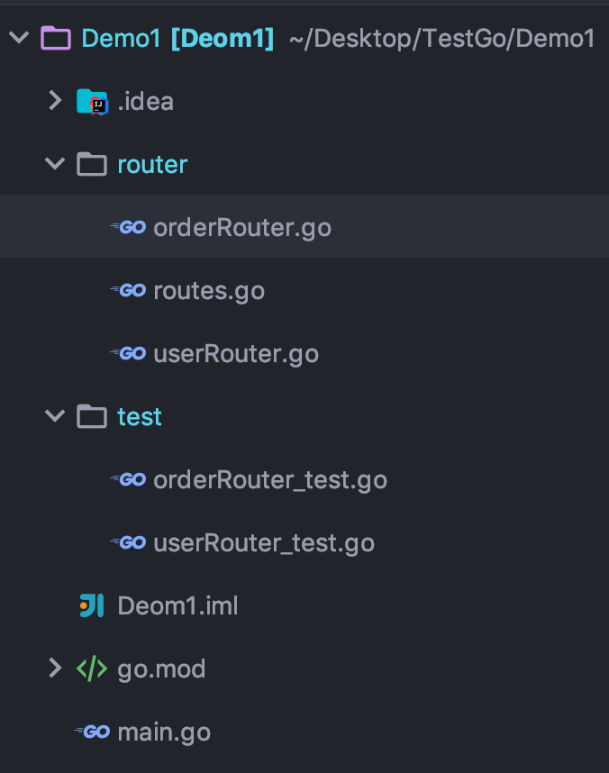

## 一 路由分组

访问路径是：`/user/login` 和 `/user/signin`
```go
package main

import (
	"github.com/gin-gonic/gin"
)

func login(c *gin.Context) {
	c.JSON(300, gin.H{
		"msg": "login",
	})
}

func logout(c *gin.Context) {
	c.JSON(300, gin.H{
		"msg": "logout",
	})
}

func main() {

	router := gin.Default()

	user := router.Group("/user")
	{
		user.GET("/login", login)
		user.GET("/logout", logout)
	}

	router.Run(":3000")
}
```

## 二 路由设计

#### 2.0 项目结构

笔者自己的路由设计，仅供参考：  

项目结构如图：  


#### 2.1 main.go

main.go：
```go
package main

import (
	"Demo1/router"
)

func main() {
	r := router.InitRouter()
	_ = r.Run()
}
```

#### 2.2 路由模块化核心 routes.go

routes.go：
```go
package router

import (
	"github.com/gin-gonic/gin"
)

func InitRouter() *gin.Engine {

	r := gin.Default()

	// 路由模块化
	userRouter(r)
	orderRouter(r)

	return r
}

```

#### 2.3 业务处理

userRouter.go示例：
```go
package router

import (
	"github.com/gin-gonic/gin"
	"net/http"
)

func userRouter(r *gin.Engine) {

	r.GET("/user/login", userLogin)

}

func userLogin(c *gin.Context){
	c.JSON(http.StatusOK, gin.H{
		"code": 10001,
		"msg": "登录成功",
		"data": nil,
	})
}
```

## 三 Gin的路由核心httprouter