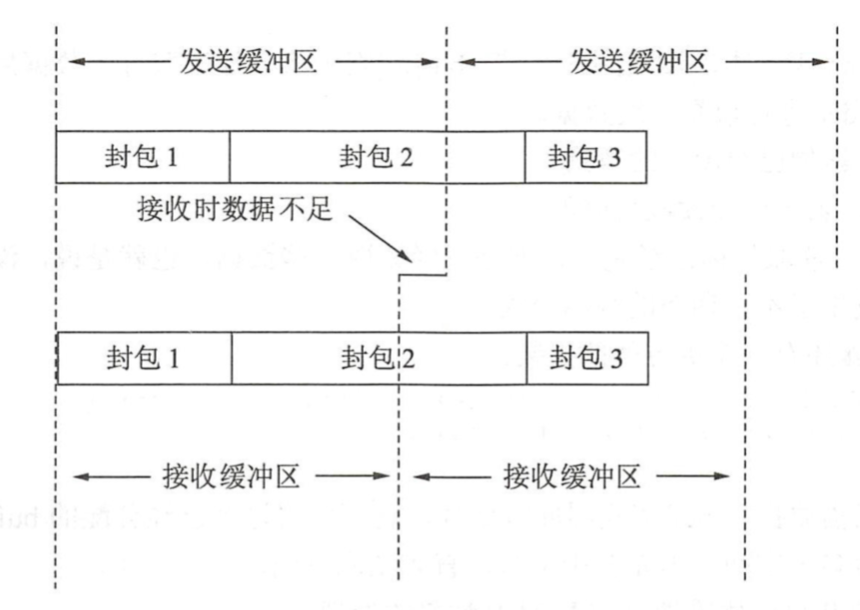

## 五 TCP粘包优雅处理

#### 5.1 粘包产生的原因

TCP数据在发送和接收时会形成粘包，也就是没有按照预期的大小得到数据，数据包不完整。  

这个问题的产生并不是因为设计、代码。  

封包在发送时，为了提高发送效率，无论是开发者使用的网络库，还是操作系统底层都会对封包进行拼包，将小包凑成大的包，在TCP层可以节约包头的大小损耗，I/O层的调用损耗也可以有所降低。  


在接收TCP封包时，接收缓冲区的大小与发送过来的TCP传输单元大小不等，这时候会造成两种情况：
- 接收的数据大于等于接收缓冲区大小时，此时需要将数据复制到用户缓忡，接着读取后面的封包。
- 接收的数据小于接收缓冲区大小时，此时需要继续等待后续的 TCP 封包。

在go语言的io包中有个函数ReadAtLeast()用来处理封装
```go
func ReadAtLeast(r Reader, buf []byte, min int) (n int, err error) {
    if len(buf) < min {
        return 0, ErrShortBuffer
    }
    for n < min && err == nil {
        var nn int
        nn, err = r.Read(buf[n:])
        n += nn
    }
    if n >= min {
        err = nil
    } else if n > 0 && err == EOF {
        err = ErrUnexpectedEOF
    }
    return
}
```

在else判断中，读取目标已经完结，但是己经读取一些数据，也就是说，没法完成读取任务，发生了不可期望的终结错误。  

ReadAtLeast还有个更好的封装：
```go
func ReadFull(r Reader, buf []byte, min int) (n int, err error) {
    return ReadAtLeast(r, buf, len(buf))
}
```
这个函数只 需要提供 buf接收缓冲 区切片，就可以将这个己经分配的 buf填充满 。 简单地说就是: 给多大空间，填充多少字节，直到填满空间。   
使用 ReadFull 可以优雅地完成对 TCP 粘包的处理。

